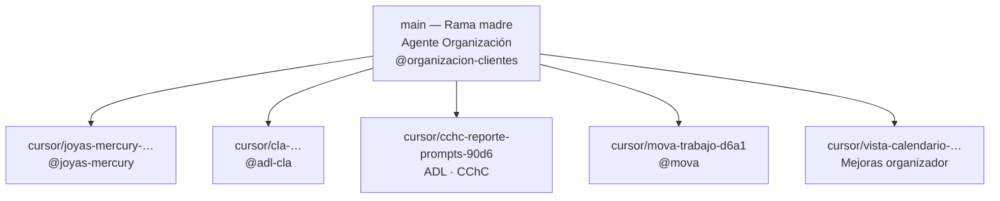

# Rama madre y ramas agente

## Modelo



| Concepto | Qué es |
|----------|--------|
| **Rama madre** | `main` — organizador, portal, `app.js`, calendario, respaldos |
| **Ramas agente** | `cursor/<nombre>-d6a1` — trabajo de un cliente/proyecto concreto |
| **Fusión** | Cuando el encargo termina, PR de la rama agente → `main` |

## Reglas

1. **No trabajar directo en `main`** para encargos de cliente — crear rama `cursor/…-d6a1`.
2. **La madre** concentra lo transversal: organizador, portal, datos compartidos.
3. **Cada agente** tiene su carpeta en `index/clientes/…` y su rama Git.
4. Panel **Agentes** en el organizador lee `data/agentes-ramas.json`.

## Recuperar trabajo de un agente

```bash
git fetch origin
git checkout main
git pull origin main

# Solo el encargo CChC (rama agente):
git checkout cursor/cchc-reporte-prompts-90d6
git pull origin cursor/cchc-reporte-prompts-90d6
```

## ADL — dos proyectos, dos ramas posibles

| Proyecto | Rama agente | Portal |
|----------|-------------|--------|
| CLA (Caja Los Andes) | `cursor/cla-*-d6a1` | `DesafioLatam/CLA.html` |
| CChC (Alfabetización Digital) | `cursor/cchc-reporte-prompts-90d6` | `DesafioLatam/CChC-Alfabetizacion/reporte-impacto/` |

No mezclar briefs ni identidad entre proyectos ADL.
