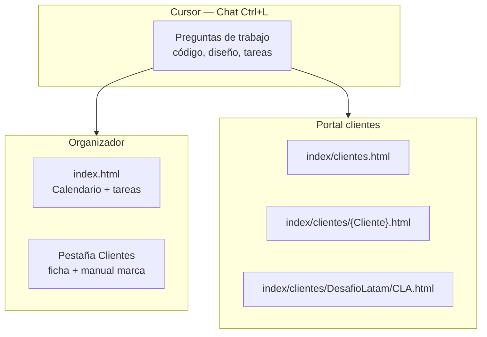
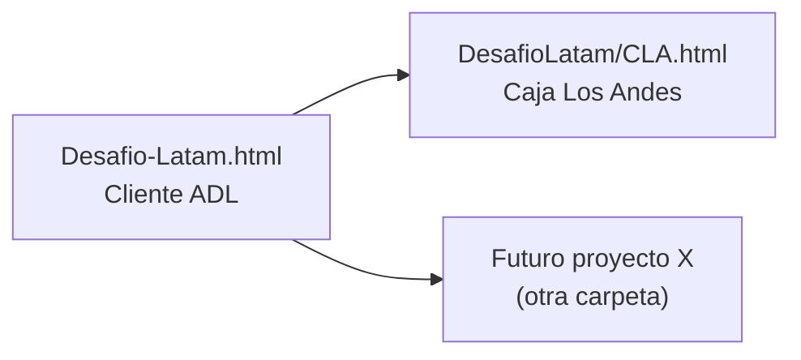

# Dónde hacer preguntas por cliente

Guía rápida: **qué abrir** y **qué decirle a Cursor** según el cliente o proyecto.

---

## Mapa general



---

## Por cliente — dónde entrar

| Cliente | Ficha portal | Preguntas en Cursor (ejemplo) |
|---------|--------------|-------------------------------|
| **Trendseeker** | `index/clientes/Trendseeker.html` | «Tarea TS de hoy: publicación redes…» |
| **ECR** | `index/clientes/ECR.html` | «Necesito copy newsletter ECR…» |
| **Joyas Mercury** | `index/clientes/joyasmercury/` | «JM tarea 01: menú WooCommerce…» |
| **Desafío Latam** | `index/clientes/Desafio-Latam.html` | «Encargo ADL: …» (elige **proyecto** abajo) |
| **Mova** | `index/clientes/Mova.html` | «MOVA: auditar charla [título]…» |
| **ADL → CLA** | `index/clientes/DesafioLatam/CLA.html` | «Proyecto CLA Caja Los Andes: certificados…» |

---

## Desafío Latam — dos niveles

ADL tiene **varios proyectos** con identidad distinta. No mezcles briefs.



| Nivel | URL local | Para qué preguntar |
|-------|-----------|-------------------|
| Cliente ADL | `…/clientes/Desafio-Latam.html` | Encargos generales, nuevo proyecto |
| **Proyecto CLA** | `…/clientes/DesafioLatam/CLA.html` | Certificados, manual Caja Los Andes, 1123×794 |

---

## Plantilla para preguntar en Cursor

Copia y adapta:

```
Cliente: Desafío Latam
Proyecto: CLA (Caja Los Andes)
Tarea de hoy: [certificados Fase 1 / diseño / etc.]
Contexto: manual en CLA/identidad/, tamaño 1123×794 px
Necesito: [lo concreto]
```

**Ejemplo real (hoy):**

```
Cliente: ADL · Proyecto CLA
Tarea: certificados modulares Fase 1 participación y aprobación
Archivo: index/clientes/DesafioLatam/CLA.html
Ajusta colores según manual-marca-caja-los-andes.pdf
```

---

## Organizador — ver la tarea de hoy

| Dónde | URL |
|-------|-----|
| App principal | `http://localhost:3000` o `index.html` |
| Tarea ADL CLA directa | `index.html?tarea=desafio-latam/01` |

*(Tras `git pull` y recargar sin `?respaldo=1`.)*

---

## API Laravel (datos)

| Recurso | URL |
|---------|-----|
| Clientes JSON | `http://127.0.0.1:8000/api/clientes` |
| Servidor | `php artisan serve` en `backend/` |

---

## Resumen en 1 frase

**Preguntas de trabajo → Cursor Chat.** Indica siempre **cliente + proyecto** (ej. ADL + CLA). **Ficha y herramientas → portal** en `index/clientes/…`.

---

## Agente Cursor dedicado (ADL · CLA)

Invocación rápida: **`docs/cursor/INVOCAR-AGENTE-ADL.md`**

En Chat (**Ctrl+L**): escribe **`@adl-cla`** y tu pregunta. La regla vive en `.cursor/rules/adl-cla.mdc`.

## Agente Cursor dedicado (Mova)

Invocación rápida: **`docs/cursor/INVOCAR-AGENTE-MOVA.md`**

En Chat (**Ctrl+L**): escribe **`@mova`** y tu pregunta. La regla vive en `.cursor/rules/mova.mdc`.
