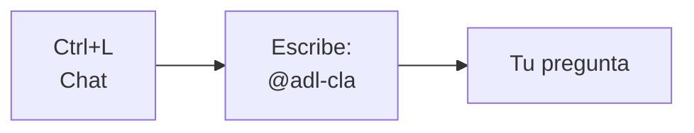

# Invocar agente ADL · CLA en Cursor

## Forma más rápida (3 clics)



1. **Ctrl + L** (chat)
2. Escribe **`@`** → busca **`adl-cla`** o **「Agente ADL CLA」**
3. Pega tu pregunta:

```
Necesito ajustar el certificado Fase 1 participación según el manual PDF.
Tamaño 1123×794. Colores Caja Los Andes.
```

---

## Forma automática

Abre cualquier archivo de CLA en el editor:

- `index/clientes/DesafioLatam/CLA.html`
- `index/assets/cla-certificados.js`

Cursor **activa solo** la regla del agente CLA al chatear.

---

## Atajo desde el organizador

1. Abre la tarea: `index.html?tarea=desafio-latam/01`
2. Usa **「Realizar tarea」** para copiar contexto al portapapeles
3. En Cursor Chat: `@adl-cla` + pega

---

## Otras frases que activan el contexto

| Dices en el chat | Agente |
|------------------|--------|
| `@adl-cla` + pregunta | CLA certificados |
| `Agente Desafío Latam proyecto CLA` | CLA |
| `Cliente ADL certificados Caja Los Andes` | CLA |

---

## Archivo de regla (avanzado)

`.cursor/rules/adl-cla.mdc` — edítalo si cambia el brief CLA.
