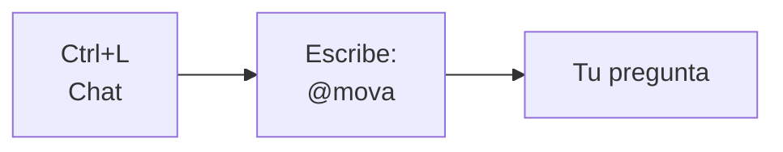

# Invocar agente Mova en Cursor

## Forma más rápida (3 clics)



1. **Ctrl + L** (chat)
2. Escribe **`@`** → busca **`mova`** o **「Agente Mova」**
3. Pega tu pregunta:

```
Necesito auditar la charla [título] con la rúbrica del proyecto.
Entregable: informe con hallazgos y recomendaciones.
```

---

## Forma automática

Abre cualquier archivo del proyecto Mova en el editor:

- `index/clientes/mova/auditoria-charlas/`
- `MOVA-Auditoria-Charlas/` (raíz del repo)
- `index/clientes/Mova.html`

Cursor **activa solo** la regla del agente Mova al chatear.

---

## Unir tu carpeta de Windows

1. Copia el contenido de `MOVA-Auditoria-Charlas` → `organizacion\index\clientes\mova\auditoria-charlas\`
2. Abre en Cursor la carpeta **`organizacion`** (raíz), no el workspace viejo suelto.
3. Si tenías reglas en `.cursor/rules/` del proyecto viejo, fusiona el texto en `.cursor/rules/mova.mdc`

---

## Atajo desde el organizador

1. Abre: `index.html?tarea=mova/01`
2. Usa **「Realizar tarea」** para copiar contexto al portapapeles
3. En Cursor Chat: `@mova` + pega

---

## Ver Mova en el navegador

```bash
npx serve .
```

| Página | URL |
|--------|-----|
| Listado | `http://localhost:3000/index/clientes/` |
| Ficha | `http://localhost:3000/index/clientes/Mova.html` |
| Proyecto | `http://localhost:3000/index/clientes/mova/` |

---

## Archivo de regla (avanzado)

`.cursor/rules/mova.mdc` — edítalo si cambia el brief o las rutas del proyecto.
