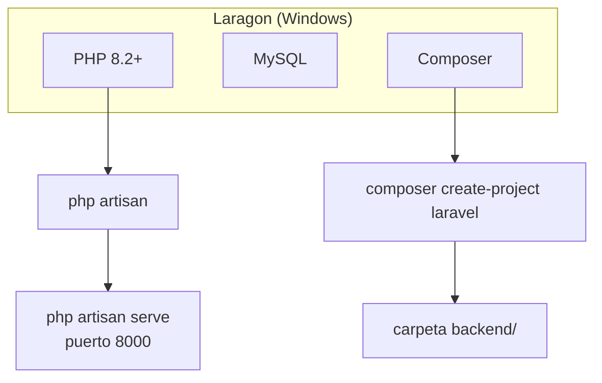
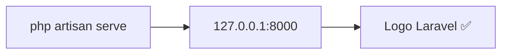
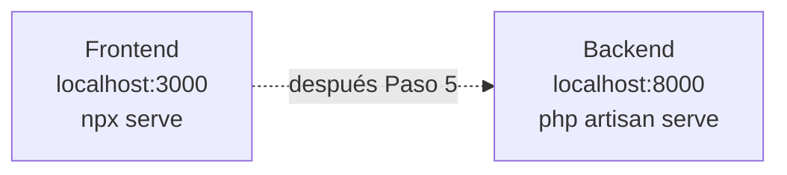

# Paso 1 — Instalar PHP, Composer y Laravel

**Meta:** ver esta pantalla en tu navegador:

```
http://127.0.0.1:8000
```

→ Página de bienvenida de Laravel con el logo.

---

## Diagrama de lo que instalas



---

## Tarea 1.1 — Instalar Laragon

1. Descarga: https://laragon.org/download/
2. Instala (siguiente, siguiente).
3. Abre **Laragon** → botón **Start All** (Apache/Nginx + MySQL en verde).

**Verificar en PowerShell** (Win + R → `powershell`):

```powershell
php -v
```

✅ Debe mostrar `PHP 8.x`. Si dice "no reconocido", en Laragon: **Menu → PHP → Version** y reinicia.

---

## Tarea 1.2 — Ir a tu proyecto

```powershell
cd "C:\Users\Josefa Ogalde\organizacion"
git pull origin main
```

---

## Tarea 1.3 — Crear Laravel en `backend/`

Si la carpeta `backend` ya existe (aunque tenga solo un README), bórrala primero:

```powershell
rmdir /s /q backend
composer create-project laravel/laravel backend
```

⏳ Tarda 2–5 minutos. Al terminar:

```powershell
dir backend\artisan
```

✅ Debe existir el archivo `artisan`.

---

## Tarea 1.4 — Arrancar el servidor

```powershell
cd backend
php artisan serve
```

Deberías ver:

```
Server running on [http://127.0.0.1:8000]
```

Abre en Chrome: **http://127.0.0.1:8000**



**No cierres** esa ventana de PowerShell mientras pruebas.

---

## Tarea 1.5 — Decirle a Cursor qué hiciste

Cuando funcione, escribe en el chat:

> **Paso 1 Laravel OK**

Y seguimos con **Paso 2 — Base de datos MySQL**.

---

## Errores frecuentes

| Error | Causa | Solución |
|-------|-------|----------|
| `php no se reconoce` | PHP no en PATH | Laragon → Start All; reinicia PowerShell |
| `composer no se reconoce` | Composer no instalado | Laragon → Tools → Composer |
| Puerto 8000 ocupado | Otro programa | `php artisan serve --port=8001` |
| `composer create-project` lento | Normal | Esperar; buena conexión WiFi |

---

## Qué NO hacer en este paso

- ❌ No crear tablas aún
- ❌ No tocar `routes/api.php` aún
- ❌ No mezclar con `npx serve` (ese es el frontend, puerto 3000)



Son **dos servidores distintos**. En Paso 5 los conectamos.

---

## Siguiente

[PASO 2 — Base de datos](./PASO-2-base-datos.md) *(desbloqueado cuando confirmes Paso 1)*
