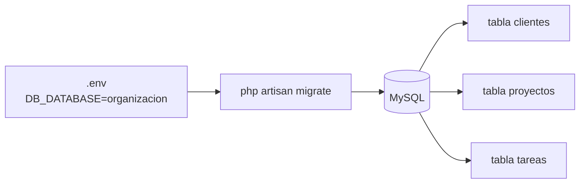

# Paso 2 — Base de datos MySQL

> ⏳ **Completa el [Paso 1](./PASO-1-entorno.md) antes de continuar.**

**Meta:** Laravel conectado a MySQL y primera tabla `clientes` creada.

---

## Diagrama



---

## Tarea 2.1 — Crear la base de datos

En **Laragon** → **Database** → **Open** (HeidiSQL) o en terminal:

```powershell
mysql -u root -e "CREATE DATABASE IF NOT EXISTS organizacion CHARACTER SET utf8mb4 COLLATE utf8mb4_unicode_ci;"
```

---

## Tarea 2.2 — Configurar `.env`

Archivo: `backend/.env`

```env
DB_CONNECTION=mysql
DB_HOST=127.0.0.1
DB_PORT=3306
DB_DATABASE=organizacion
DB_USERNAME=root
DB_PASSWORD=
```

*(Laragon suele dejar password vacío.)*

Probar conexión:

```powershell
cd backend
php artisan migrate:status
```

✅ Sin error de conexión.

---

## Tarea 2.3 — Primera migración (tabla clientes)

En Cursor, pídeme:

> "Crea la migración de clientes Paso 2"

O tú misma:

```powershell
php artisan make:migration create_clientes_table
```

Luego editamos la migración y ejecutamos:

```powershell
php artisan migrate
```

---

## Tarea 2.4 — Verificar en MySQL

```powershell
mysql -u root organizacion -e "SHOW TABLES;"
```

✅ Debe aparecer `clientes`.

---

## Confirmación

Responde: **«Paso 2 Laravel OK»** → Paso 3 (Modelos Eloquent).

SQL de referencia completo: [`schema-organizacion.sql`](./schema-organizacion.sql)
