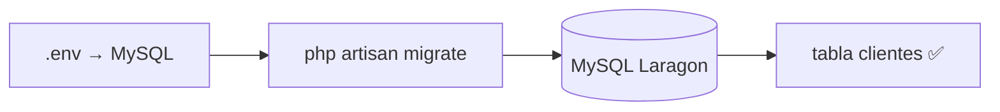

# Paso 2 — Base de datos MySQL

> ✅ Paso 1 listo si ves Laravel en `127.0.0.1:8000`

**Meta:** MySQL conectado + tabla `clientes` creada.

---

## Diagrama



---

## Tarea 2.1 — Crear base de datos

**Opción A — Laragon:** botón **「Base de Datos」** → HeidiSQL → Create database → `organizacion`

**Opción B — Terminal:**

```cmd
mysql -u root -e "CREATE DATABASE IF NOT EXISTS organizacion CHARACTER SET utf8mb4 COLLATE utf8mb4_unicode_ci;"
```

---

## Tarea 2.2 — Editar `.env`

Archivo: `backend\.env`

```env
DB_CONNECTION=mysql
DB_HOST=127.0.0.1
DB_PORT=3306
DB_DATABASE=organizacion
DB_USERNAME=root
DB_PASSWORD=
```

> Cambia `DB_CONNECTION=sqlite` → `mysql` (Laravel 11 usa SQLite por defecto).

---

## Tarea 2.3 — Probar conexión

```cmd
cd "C:\Users\Josefa Ogalde\organizacion\backend"
php artisan migrate:status
```

✅ Sin error rojo.

---

## Tarea 2.4 — Crear migración `clientes`

```cmd
php artisan make:migration create_clientes_table
```

Copia el código de [`ejemplos/migration_create_clientes_table.php`](./ejemplos/migration_create_clientes_table.php) al archivo generado.

---

## Tarea 2.5 — Ejecutar migración

```cmd
php artisan migrate
```

---

## Tarea 2.6 — Verificar

```cmd
mysql -u root organizacion -e "SHOW TABLES;"
```

✅ Aparece `clientes`.

---

## Confirmación

**「Paso 2 Laravel OK」** → [Paso 3 — Modelos](./PASO-3-modelos.md)
