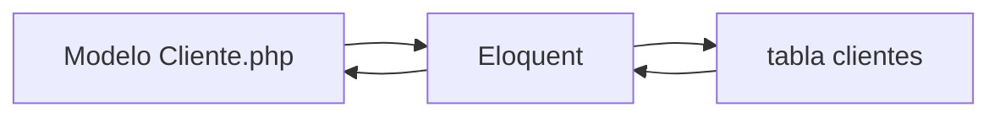

# Paso 3 — Modelos Eloquent

> ⏳ Completa [Paso 2](./PASO-2-base-datos.md) primero.

**Meta:** en `php artisan tinker` poder escribir `Cliente::count()` y ver un número.

---

## Tareas

| # | Comando / acción | Resultado |
|---|------------------|-----------|
| 3.1 | `php artisan make:model Cliente` | Archivo en `app/Models/Cliente.php` |
| 3.2 | Definir `$fillable` | Campos que se pueden guardar |
| 3.3 | `php artisan tinker` → `Cliente::create([...])` | 1 fila en MySQL |
| 3.4 | `Cliente::all()` | Lista en consola |

Confirmación: **«Paso 3 Laravel OK»**

Siguiente: [PASO 4 — API REST](./PASO-4-api-rest.md)
