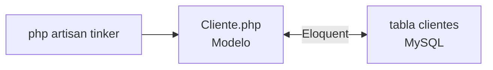

# Paso 3 — Modelo Eloquent `Cliente`

> ✅ Paso 2 listo si `php artisan migrate` mostró `create_clientes_table ... DONE`

**Meta:** guardar y leer clientes desde PHP con `Cliente::all()`.

---

## Diagrama



| Capa | Qué es |
|------|--------|
| **Modelo** | Clase PHP que representa una fila de `clientes` |
| **Eloquent** | Traductor automático PHP ↔ SQL |
| **Tinker** | Consola para probar sin API |

---

## Tarea 3.1 — Crear modelo

```cmd
cd "C:\Users\Josefa Ogalde\organizacion\backend"
php artisan make:model Cliente
```

---

## Tarea 3.2 — Editar `Cliente.php`

Abre: `backend\app\Models\Cliente.php`

Reemplaza el contenido con [`ejemplos/Model_Cliente.php`](./ejemplos/Model_Cliente.php) o pega:

```php
<?php

namespace App\Models;

use Illuminate\Database\Eloquent\Model;

class Cliente extends Model
{
    protected $table = 'clientes';

    protected $fillable = [
        'slug', 'nombre', 'abrev', 'tipo',
        'color_border', 'color_bg', 'color_text',
        'agente', 'resumen',
    ];
}
```

---

## Tarea 3.3 — Insertar un cliente de prueba

```cmd
php artisan tinker
```

Dentro de tinker (copia línea por línea):

```php
\App\Models\Cliente::create([
    'slug' => 'trendseeker',
    'nombre' => 'Trendseeker - Talk',
    'abrev' => 'TS',
    'tipo' => 'full-time',
    'agente' => 'Community Manager + WordPress',
    'resumen' => 'Redes y WordPress',
]);
```

Salir: `exit`

---

## Tarea 3.4 — Verificar

```cmd
php artisan tinker
```

```php
\App\Models\Cliente::count();
\App\Models\Cliente::all();
```

✅ `count()` debe ser **1** (o más si insertaste varios).

En **HeidiSQL**: `organizacion` → tabla `clientes` → **Datos** → debe aparecer Trendseeker.

---

## Confirmación

**「Paso 3 Laravel OK」** → [Paso 4 — API REST](./PASO-4-api-rest.md)
