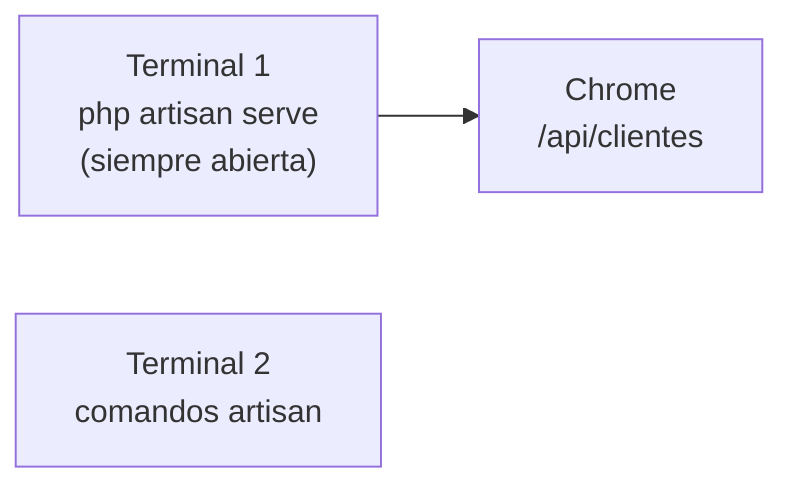

# Paso 4 — Tu primera API REST

> ✅ Paso 3 listo si insertaste Trendseeker con tinker (`id: 1`)

**Meta:** `http://127.0.0.1:8000/api/clientes` → JSON en Chrome.

---

## Errores que viste (y cómo evitarlos)

| Error | Causa | Solución |
|-------|-------|----------|
| `Parse error` en tinker | Corriste `artisan` **dentro** de tinker | Escribe `exit` primero |
| `ERR_CONNECTION_REFUSED` | Servidor apagado | `php artisan serve` en otra terminal |

---

## Dos terminales



---

## Tarea 4.0 — Salir de tinker

Si ves el prompt `>`:

```php
exit
```

---

## Tarea 4.0b — Instalar rutas API (Laravel 11)

Si en `routes\` **no ves** `api.php`, ejecuta:

```cmd
php artisan install:api
```

Esto crea `routes\api.php`. Responde **yes** si pregunta por Sanctum.

---

## Tarea 4.1 — Crear controlador

```cmd
cd "C:\Users\Josefa Ogalde\organizacion\backend"
php artisan make:controller Api/ClienteController
```

---

## Tarea 4.2 — Código del controlador

Abre `app\Http\Controllers\Api\ClienteController.php`

Pega (reemplaza todo) — ver [`ejemplos/ClienteController.php`](./ejemplos/ClienteController.php):

```php
<?php

namespace App\Http\Controllers\Api;

use App\Http\Controllers\Controller;
use App\Models\Cliente;

class ClienteController extends Controller
{
    public function index()
    {
        return response()->json(Cliente::all());
    }
}
```

---

## Tarea 4.3 — Ruta en `routes/api.php`

Abre `routes\api.php` y **añade** al final (antes del cierre si hay):

```php
use App\Http\Controllers\Api\ClienteController;

Route::get('/clientes', [ClienteController::class, 'index']);
```

---

## Tarea 4.4 — Arrancar servidor

**Terminal 1** (déjala abierta):

```cmd
cd "C:\Users\Josefa Ogalde\organizacion\backend"
php artisan serve
```

---

## Tarea 4.5 — Probar en Chrome

```
http://127.0.0.1:8000/api/clientes
```

✅ Debes ver JSON con Trendseeker.

---

## Confirmación

**「Paso 4 Laravel OK」** → [Paso 5 — Conectar portal](./PASO-5-conectar-frontend.md)
