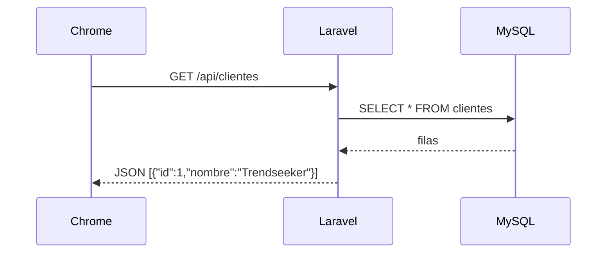

# Paso 4 — Tu primera API REST

> ⏳ Completa [Paso 3](./PASO-3-modelos.md) primero.

**Meta:** abrir `http://127.0.0.1:8000/api/clientes` y ver JSON.

---

## Qué es una API REST (en 10 segundos)



| Método HTTP | Acción | Ejemplo |
|-------------|--------|---------|
| **GET** | Leer | Listar clientes |
| **POST** | Crear | Nueva tarea |
| **PUT/PATCH** | Actualizar | Marcar tarea hecha |
| **DELETE** | Borrar | Eliminar tarea |

---

## Tareas

| # | Qué haces | Archivo |
|---|-----------|---------|
| 4.1 | Crear controlador | `php artisan make:controller Api/ClienteController` |
| 4.2 | Método `index()` → `Cliente::all()` | `ClienteController.php` |
| 4.3 | Ruta GET | `routes/api.php` |
| 4.4 | Probar en Chrome | `/api/clientes` |

### Ejemplo de respuesta JSON

```json
[
  {"id": 1, "nombre": "Trendseeker - Talk", "abrev": "TS", "tipo": "full-time"},
  {"id": 2, "nombre": "ECR - Talk", "abrev": "ECR", "tipo": "full-time"}
]
```

Confirmación: **«Paso 4 Laravel OK»**

Siguiente: [PASO 5 — Conectar frontend](./PASO-5-conectar-frontend.md)
