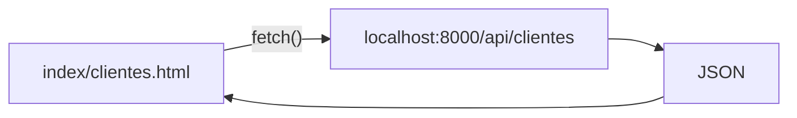

# Paso 5 — Conectar el portal HTML con la API

> ⏳ Completa [Paso 4](./PASO-4-api-rest.md) primero.

**Meta:** `clientes.html` carga la lista desde Laravel en vez de `clientes-data.js`.

---

## Dos servidores a la vez

| Terminal 1 | Terminal 2 |
|------------|------------|
| `npx serve .` → puerto **3000** | `php artisan serve` → puerto **8000** |

## Tareas

| # | Acción |
|---|--------|
| 5.1 | CORS en Laravel (`config/cors.php`) |
| 5.2 | Cambiar `portal-landing.js` → `fetch('/api/clientes')` |
| 5.3 | Probar portal en `localhost:3000` |

Confirmación: **«Paso 5 Laravel OK»**
