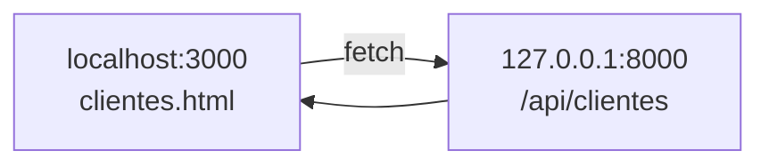

# Paso 5 — Conectar el portal HTML con la API

> ✅ Paso 4 listo si ves JSON en `http://127.0.0.1:8000/api/clientes`

**Meta:** `clientes.html` muestra clientes desde Laravel (etiqueta **· API** en la tarjeta).

---

## Diagrama



---

## Dos terminales abiertas

| Terminal | Comando | Puerto |
|----------|---------|--------|
| **1** | `php artisan serve` | 8000 |
| **2** | `npx serve .` (en `organizacion\`) | 3000 |

---

## Tarea 5.1 — CORS en Laravel

Abre `backend\config\cors.php` y en `allowed_origins` añade:

```php
'allowed_origins' => [
    'http://localhost:3000',
    'http://127.0.0.1:3000',
],
```

Guarda. Si `php artisan serve` ya corre, no hace falta reiniciar.

---

## Tarea 5.2 — Actualizar el frontend

```cmd
cd "C:\Users\Josefa Ogalde\organizacion"
git pull origin main
```

El archivo `index\assets\portal-landing.js` ya hace `fetch` a la API y, si falla, usa `clientes-data.js`.

---

## Tarea 5.3 — Probar

1. Terminal 1: `php artisan serve` (backend)
2. Terminal 2: `npx serve .` (raíz organizacion)
3. Chrome: `http://localhost:3000/index/clientes.html`

✅ Tarjeta Trendseeker con **· API** en el tipo.

---

## Si no ves · API

| Problema | Solución |
|----------|----------|
| CORS error en F12 | Revisa `config/cors.php` |
| Solo datos viejos | ¿`php artisan serve` corriendo? |
| git pull falla | Copia `portal-landing.js` del repo manualmente |

---

## Confirmación

**「Paso 5 Laravel OK」** → [Paso 6 — Auth](./PASO-6-auth.md) (opcional)
