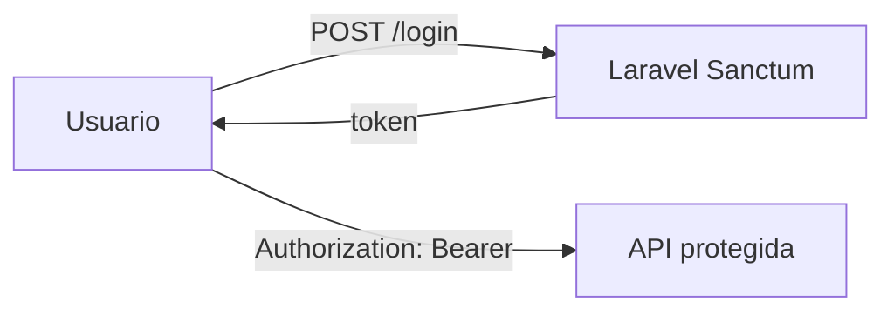

# Paso 6 — Autenticación (opcional, después)

> Cuando el portal y la API básica funcionen.

**Meta:** solo usuarios logueados pueden crear/editar tareas.

Laravel incluye **Sanctum** para APIs simples.

Confirmación futura: **«Paso 6 Laravel OK»**
