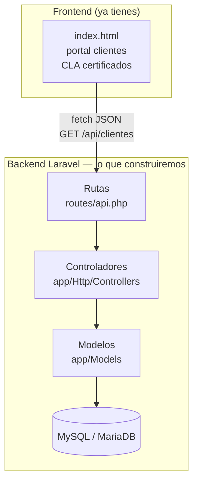
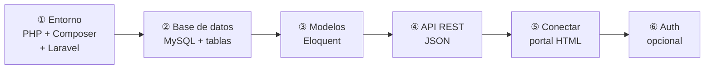
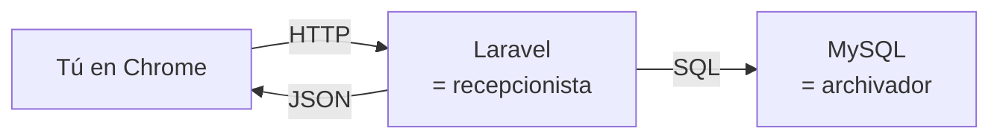
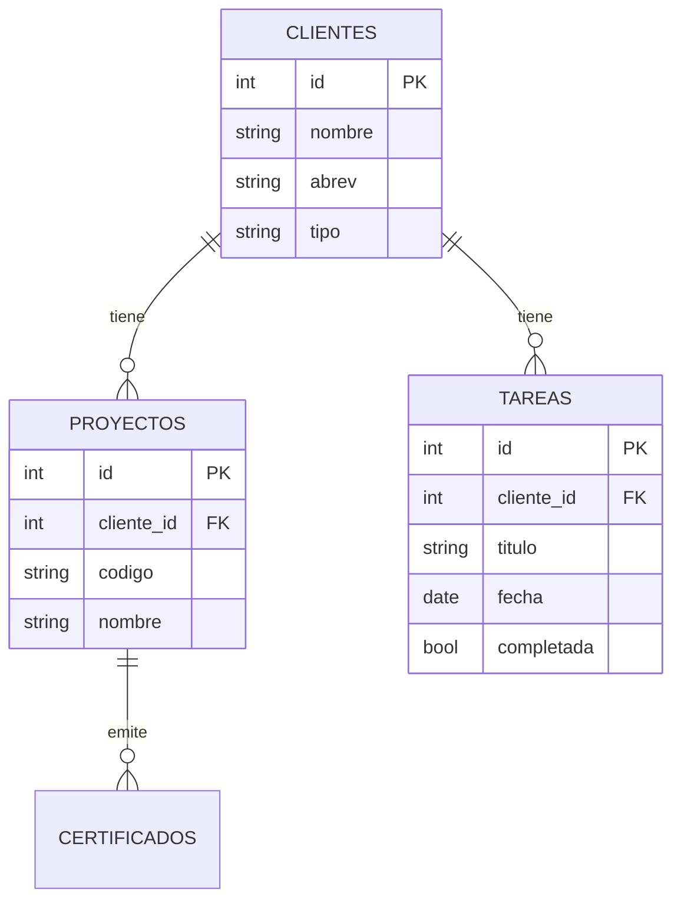
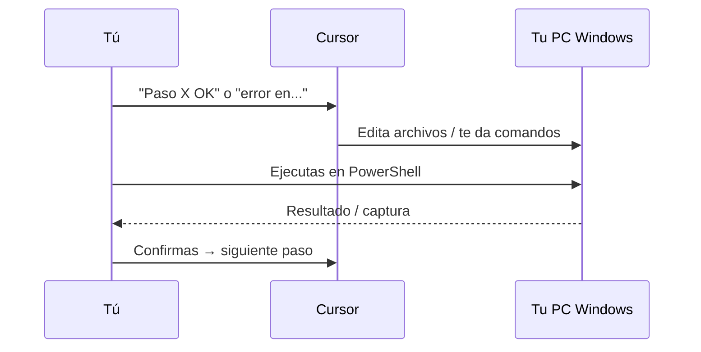

# Laravel + SQL + API — Curso para Organización

Aprende haciendo, en pasos pequeños. **No avances al siguiente paso hasta confirmar el anterior.**

---

## Mapa completo (visión general)

---

## Los 6 pasos del curso

| Paso | Archivo guía | Qué logras |
|------|--------------|------------|
| **①** | [PASO-1-entorno.md](./PASO-1-entorno.md) | `php artisan serve` → página Laravel |
| **②** | [PASO-2-base-datos.md](./PASO-2-base-datos.md) | Tablas SQL + migraciones |
| **③** | [PASO-3-modelos.md](./PASO-3-modelos.md) | Modelos Cliente, Tarea, Proyecto |
| **④** | [PASO-4-api-rest.md](./PASO-4-api-rest.md) | `GET /api/clientes` devuelve JSON |
| **⑤** | [PASO-5-conectar-frontend.md](./PASO-5-conectar-frontend.md) | Portal lee datos del servidor |
| **⑥** | [PASO-6-auth.md](./PASO-6-auth.md) | Login / tokens (después) |

---

## Qué es cada pieza (1 imagen mental)

| Pieza | Analogía | En código |
|-------|----------|-----------|
| **PHP** | El idioma del servidor | `.php` |
| **Laravel** | Framework — estructura lista | carpeta `backend/` |
| **MySQL** | Base de datos relacional | tablas con filas |
| **API REST** | Menú de URLs que devuelven JSON | `/api/clientes` |
| **Eloquent** | Traductor PHP ↔ SQL | `Cliente::all()` |

---

## Base de datos que usaremos (preview)

SQL de referencia: [`schema-organizacion.sql`](./schema-organizacion.sql)

---

## Herramientas que usarás

| Herramienta | Para qué | Dónde |
|-------------|----------|-------|
| **Laragon** | PHP + MySQL + terminal en Windows | [laragon.org](https://laragon.org) |
| **Composer** | Instalar Laravel | Viene con Laragon |
| **Cursor** | Editar código + agente | Ya lo tienes |
| **Chrome** | Probar API y portal | DevTools → Network |
| **Postman** *(opcional)* | Probar API sin frontend | [postman.com](https://www.postman.com) |

---

## Cómo trabajar con Cursor en cada paso

**Tú ejecutas en Windows.** La terminal `workspace $` de la nube es solo para el agente.

---

## Empieza aquí

👉 **[PASO 1 — Instalar entorno](./PASO-1-entorno.md)**

Cuando veas la página de bienvenida de Laravel, responde: **«Paso 1 Laravel OK»**
