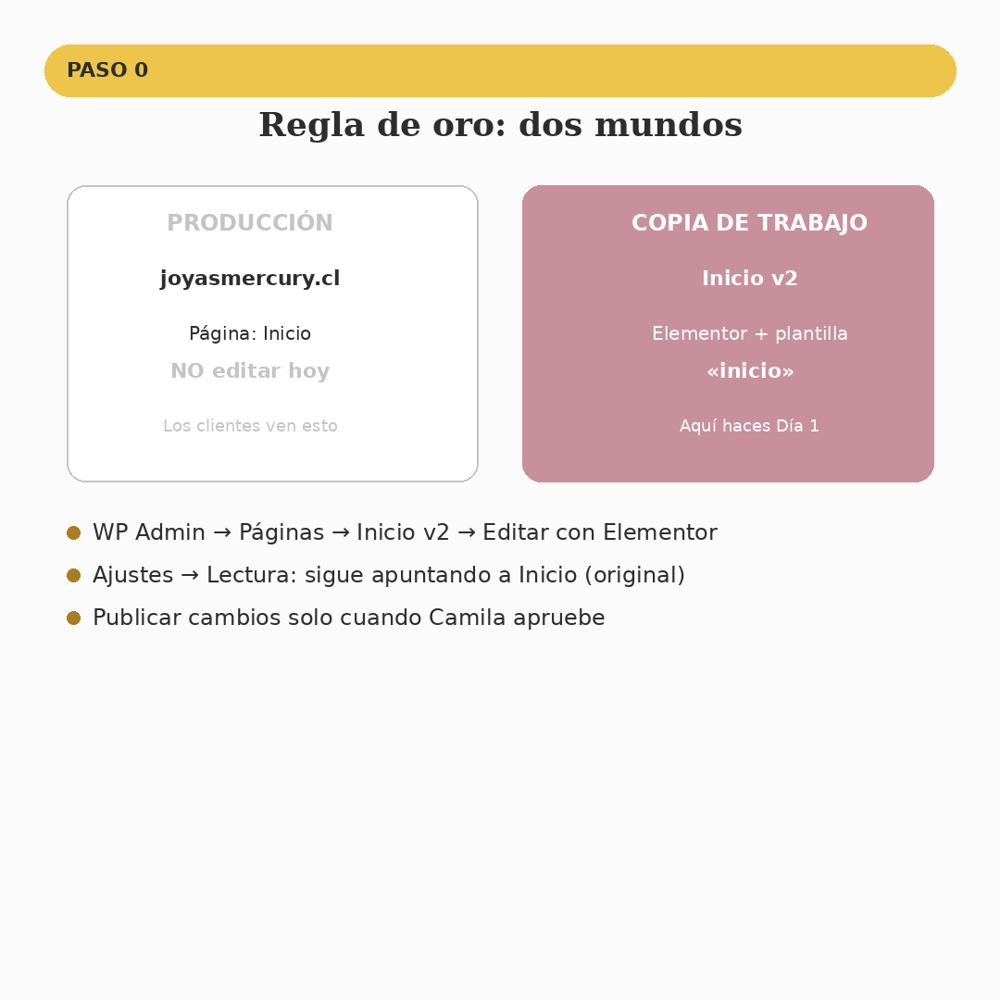
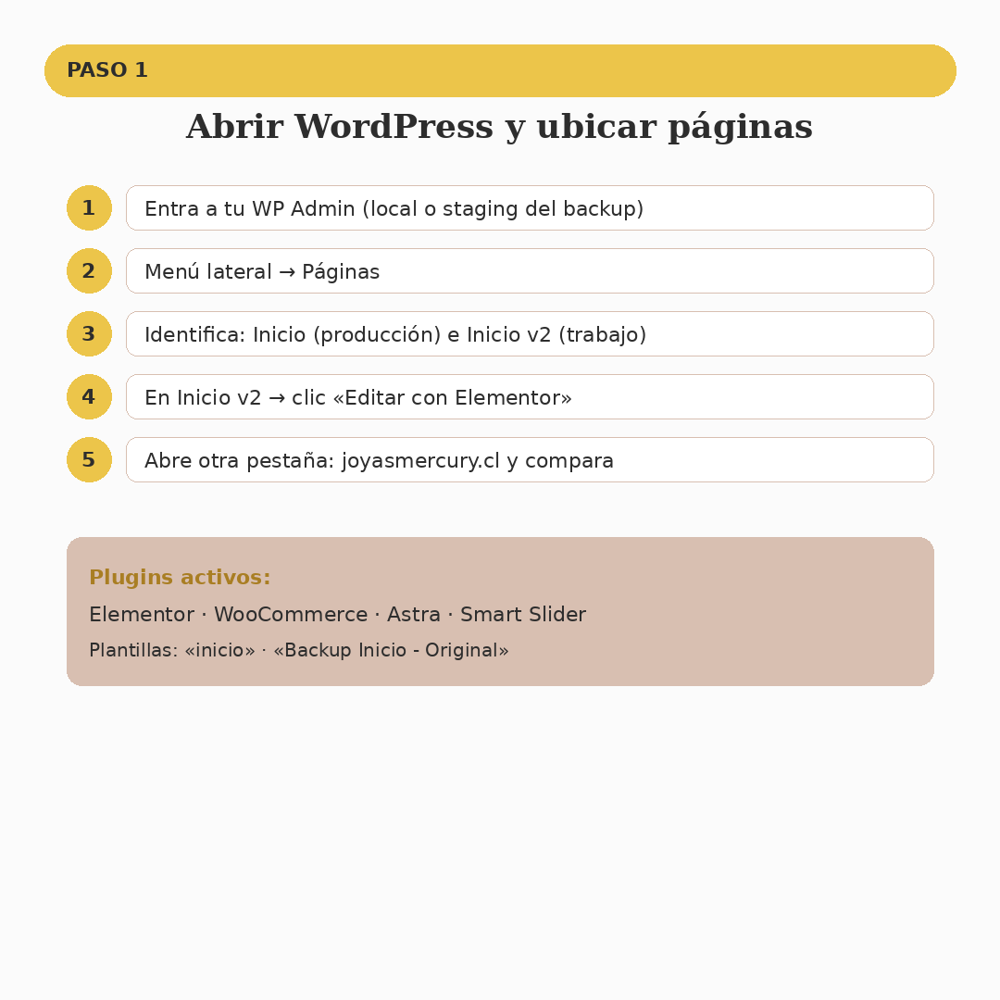
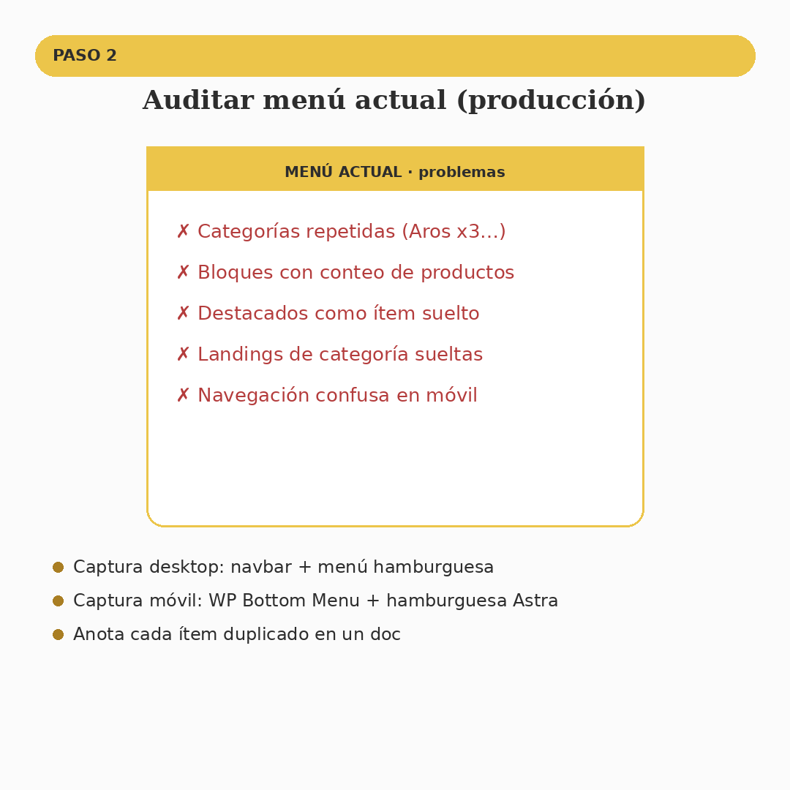
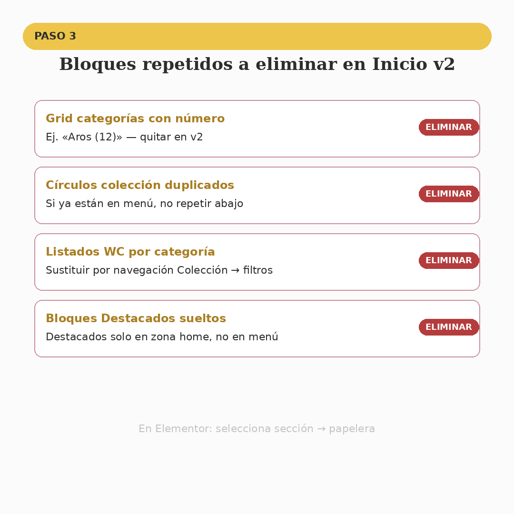
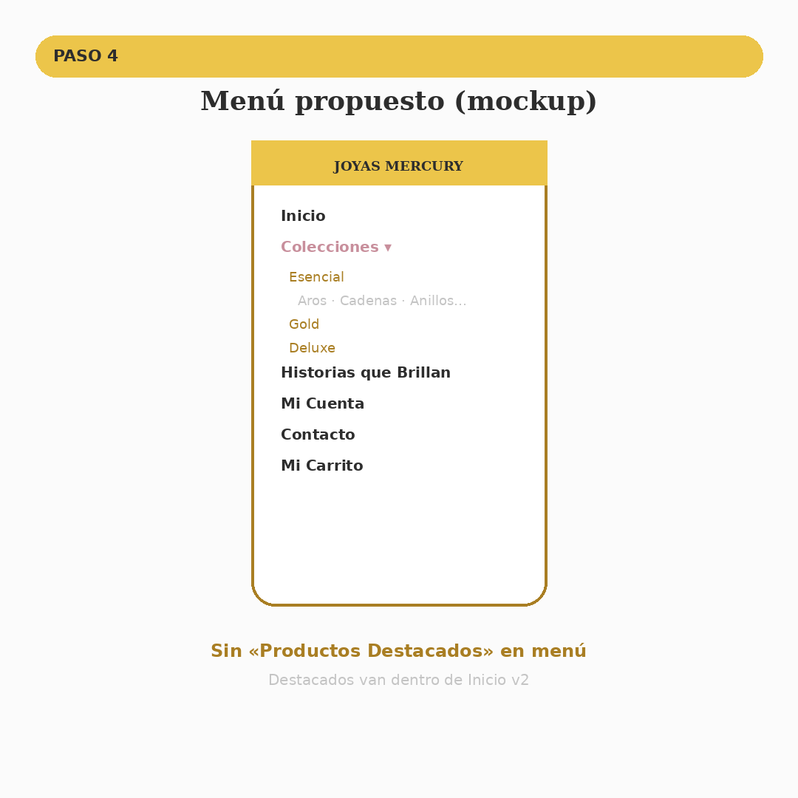
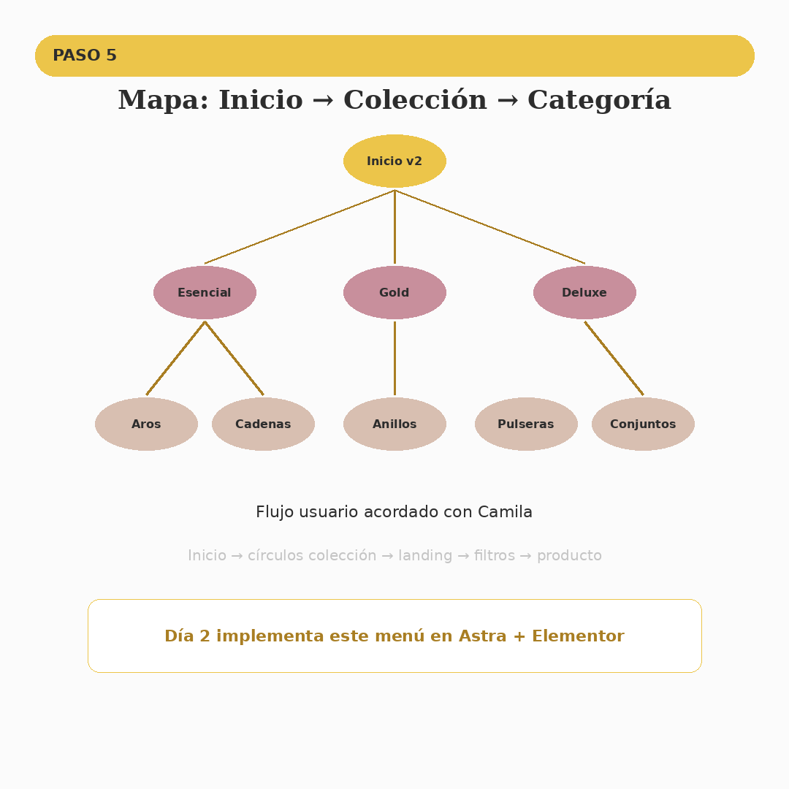
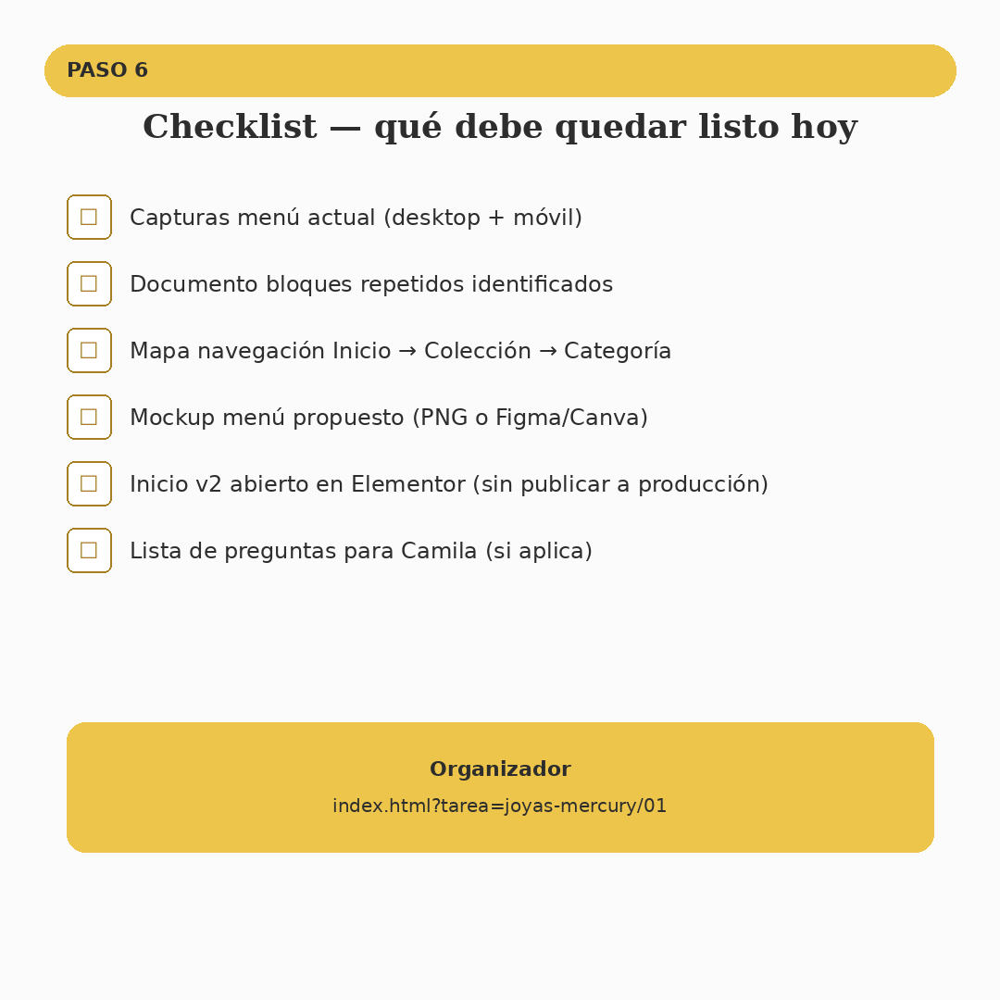

# Día 1 — Joyas Mercury · Auditoría menú y bloques repetidos

**Cliente:** Camila — Joyas Mercury  
**Tarea:** `[JM] E1 — Auditoría menú y bloques repetidos`  
**Organizador:** `index.html?tarea=joyas-mercury/01`  
**Agente Cursor:** `@joyas-mercury`

---

## Regla de oro

| Mundo | Qué es | Qué haces hoy |
|-------|--------|----------------|
| **Producción** | https://joyasmercury.cl — página **Inicio** | Solo mirar y capturar. **No editar.** |
| **Copia de trabajo** | Página **Inicio v2** + Elementor | Auditar bloques y planificar menú nuevo |

El sitio en vivo **sigue igual**. Todo el rediseño va en la copia hasta que Camila apruebe.

---

## Paso a paso

### Paso 0 — Dos mundos (imagen 01)



- **Ajustes → Lectura** debe seguir mostrando la página **Inicio** (original).
- Trabajas en **Inicio v2** con plantilla Elementor «inicio».

---

### Paso 1 — Abrir WordPress (imagen 02)



1. Entra al WP Admin de tu backup/staging (`joyasmercury-backup` local).
2. **Páginas** → localiza **Inicio** y **Inicio v2**.
3. En **Inicio v2** → **Editar con Elementor**.
4. En otra pestaña abre **joyasmercury.cl** para comparar.

---

### Paso 2 — Auditar menú actual (imagen 03)



**Problemas a documentar:**

- Categorías repetidas en menú hamburguesa
- Bloques con conteo de productos (`Aros (12)`)
- «Productos Destacados» como ítem de menú
- Landings de categoría sueltas
- Navegación confusa en móvil

**Entregable:** 2 capturas (desktop navbar + móvil hamburguesa).

---

### Paso 3 — Bloques a quitar en Inicio v2 (imagen 04)



En Elementor, marca (no borres aún si prefieres) estas secciones en **Inicio v2**:

| Bloque | Acción |
|--------|--------|
| Grid categorías con número | Eliminar en v2 |
| Círculos colección duplicados | Dejar solo uno (menú o home, no ambos) |
| Listados WC por categoría | Reemplazar en Día 2–3 por flujo Colección |
| Destacados en menú | Quitar del menú; quedan en zona home |

---

### Paso 4 — Mockup menú propuesto (imagen 05)



**Menú objetivo:**

```
Inicio
Colecciones ▾
  Esencial → Aros, Cadenas, Anillos, Pulseras, Conjuntos
  Gold     → (mismas 5 categorías)
  Deluxe   → (mismas 5 categorías)
Historias que Brillan
Mi Cuenta
Contacto
Mi Carrito
```

Navbar: **lupa** + **carrito**. WhatsApp verde (no cambiar color).

---

### Paso 5 — Mapa de navegación (imagen 06)



```
Inicio v2
  └── Colección (Esencial / Gold / Deluxe)
        └── Categoría (Aros, Cadenas, Anillos, Pulseras, Conjuntos)
              └── Filtros visuales (Día 3+)
                    └── Ficha producto → Carrito
```

---

### Paso 6 — Checklist del día (imagen 07)



- [ ] Capturas menú actual (desktop + móvil)
- [ ] Lista de bloques repetidos
- [ ] Mapa navegación guardado
- [ ] Mockup menú propuesto
- [ ] Inicio v2 abierto en Elementor (sin publicar a producción)
- [ ] Preguntas para Camila anotadas

---

## Paleta (manual de marca)

| Color | Hex | Uso |
|-------|-----|-----|
| Dorado | `#ECC54A` | Acentos, header menú |
| Dorado oscuro | `#A97E23` | Subítems colección |
| Rosa | `#C88F9C` | Colecciones, CTAs suaves |
| Beige | `#D8BFB1` | Fondos, categorías |
| Gris | `#C4C4C4` | Textos secundarios |

---

## Día 2 (siguiente)

`[JM] E1 — Menú limpio y navegación por colección` — implementar el menú propuesto en Astra + Elementor.

---

## Regenerar imágenes

```bash
python3 scripts/generar-jm-dia1-guia.py
```
